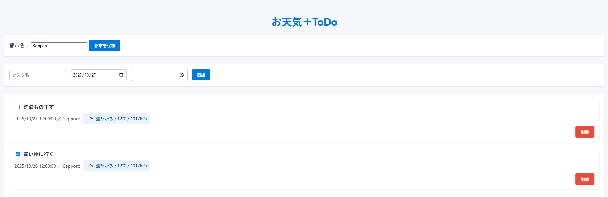
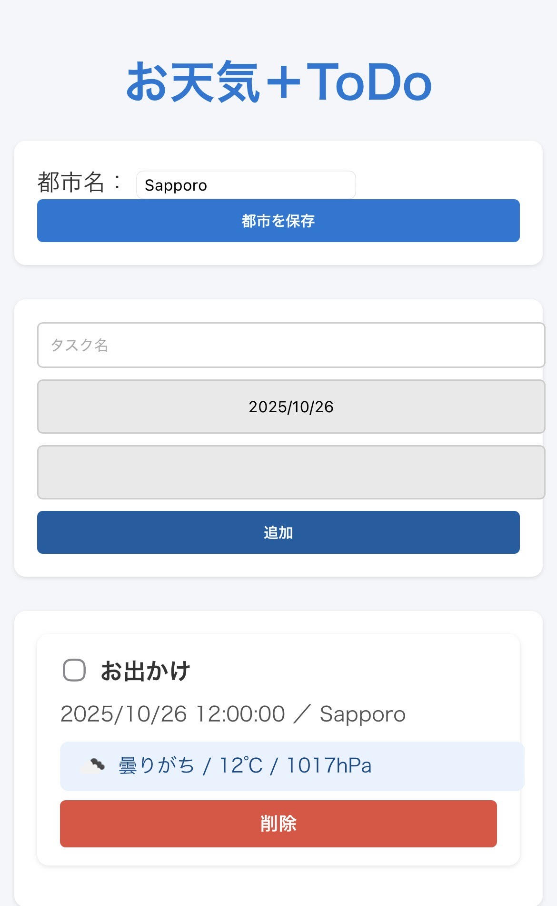

# 🌤️ お天気＋ToDo（MVP）

  
📍 *Simple Weather + Task Management App*

---

## 🧩 主な機能
- ✅ タスク追加・削除・完了チェック（ローカルストレージ保存）
- 🏙️ 都市名の保存（デフォルト都市設定機能）
- ☁️ OpenWeatherMap API を利用した天気情報表示  
  - 気温・天候・気圧を取得  
  - 🌦️ 天気アイコンを表示
- 💾 都市ごとにキャッシュを保持し、APIアクセスを最小化
- 📱 モバイル対応（レスポンシブデザイン）

---

## 🛠️ 使用技術
| 分類 | 内容 |
|------|------|
| フロントエンド | HTML / CSS / JavaScript (Vanilla) |
| 外部API | OpenWeatherMap API |
| デプロイ | GitHub Pages |
| 管理 | Git + GitHub |

---

## 🌈 今後の展望
- ⏰ タスク時間に応じた天気の再取得  
- ☂️ 天気によるリマインダー通知機能（例：「雨の日は傘を持って出よう☂️」）  
- ⚛️ React 版またはノーコード（Glide/STUDIO）版MVP  

---

## 📸 スクリーンショット

---

## 👤 作者
**MEI-OKU (Hikaru Taniguchi)**  
📧 rightgucci12@gmail.com  
💻 [GitHub Profile](https://github.com/MEI-OKU)

---

## ⚖️ ライセンス
This project is licensed under the [MIT License](LICENSE).

---

## 💡 ヒント
- スクリーンショット画像は  
  `/assets/images/screenshot-hero.png` に保存してリンク。  
- GitHub Pages 公開URLは  
  [https://mei-oku.github.io/weather-todo-app/](https://mei-oku.github.io/weather-todo-app/)
